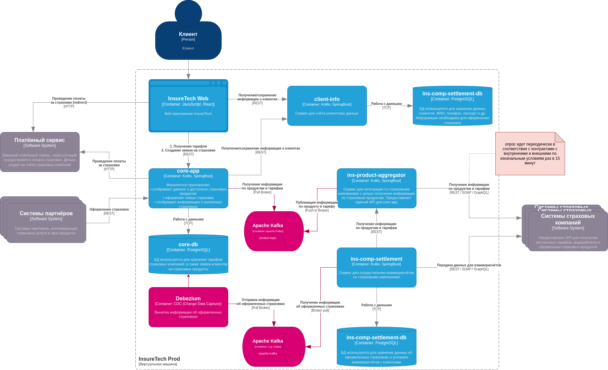

# Задание 3. Переход на Event-Driven архитектуру

### Риски:  
* Синхронные запросы к _ins-product-aggregator_
    * Задержки из-за зависимостей от API страховых компаний.
    * Низкая отказоустойчивость (если один провайдер недоступен, весь запрос может упасть).
    * Масштабируемость под вопросом (при добавлении 5 новых компаний время ответа может увеличиться).

* Рост ошибок при масштабировании
    * Увеличение числа страховых компаний → рост времени ответа _ins-product-aggregator_.
    Возможные таймауты и сбои при агрегации данных.

## Решение
Переход на EDA с отправкой сообщений по мере их обновления, как из _ins-product-aggregator_ так и из _core-app_.

 Использование Transactional Outbox для отправки информации об оформленных страховках. Т.к. эти данные критичны, и могут вести к финансовым потерям. _ins-product-aggregator_ не требует такого усложнения по причине его повторных отправок данных.

