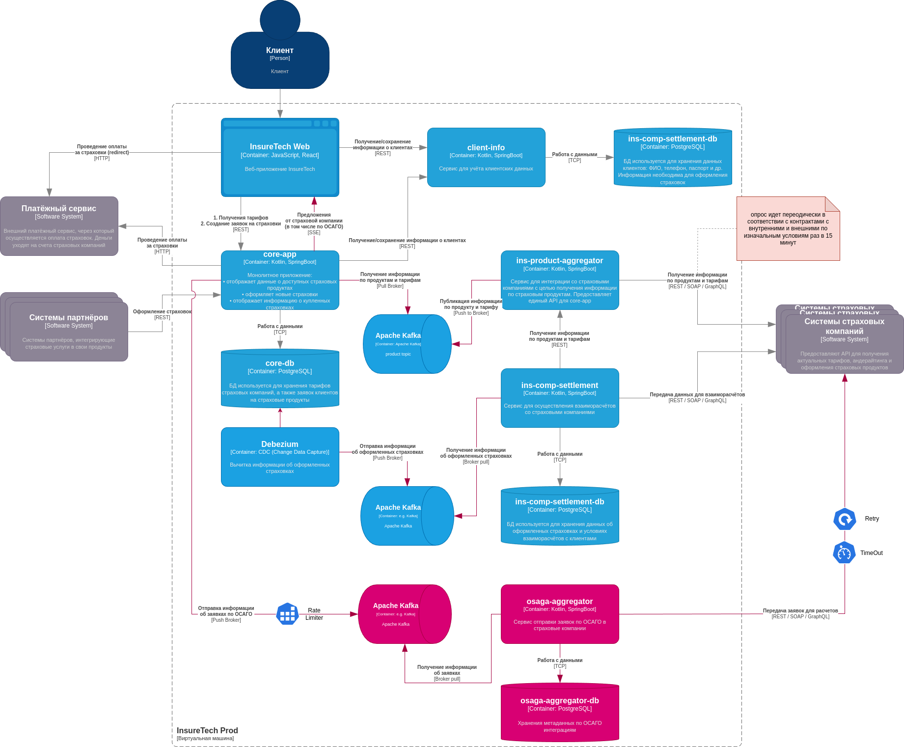

# Задание 4. Проектирование продажи ОСАГО

**Требуется ли ему своё хранилище данных?**
 
Собственное хранилище данных не требуется, для работы с метаданными связанными непосредственно с работой сервиса, например об интеграциях
    

**Определите средство интеграции между сервисами core-app и osago-aggregator.**

как средство интеграции будет выступать обмен сообщениями через Kafka, исходящие от core-app, и входящие и osago-aggregator

**Подумайте над API для веб-приложения в core-app.**

Веб-приложение будет использовать SSE для получения результатов. Запросы будет оправляться через REST.
т.к. фактически, по сценарию описаному в задачи клиент заполняет форму, и отправляет ее, делая один запрос, и после получает множество результатов (однонаправленная связь). 
SSE с учетом того, что есть множество экземпляров приложения и балансировщики нагрузки выглядит более подходящим вариантом.

**В зависимости от выбранных средств интеграции подумайте, требуется ли где-то применение паттернов отказоустойчивости**:

Rate Limiting для запросов к страховым компаниям, для соответсвия контрактам. 

Retry - для снижения вероятности временных сбоев, например во время обновления сервисов на стороне страховых компаний.

Timeout - для того чтобы снизить время ожидания в условиях того, что пользователь ожидает видеть результаты по мере их поступления.

#### Решение

